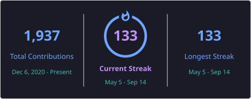

---

## 👋 Hi, I'm Ranesh Rajit

- 🎓 B.Tech Computer Science Student from India
- 💻 Focused on **Java, DSA, Spring Boot & PostgreSQL**
- 🌱 Learning in public — every problem I solve goes into my [public repo](https://github.com/rajit2004/java_progress)
- 🤝 Active open-source contributor
- 🌐 My portfolio → [rajit2004.github.io](https://rajit2004.github.io/)
- 📋 Full contribution history → [rajit2004/open-source-contributions](https://github.com/rajit2004/open-source-contributions)
- 🚀 Building real projects and solving coding problems daily
- 🎯 Goal: Become a strong **Software Engineer**

---

## 🚀 Tech Stack

### 🧑‍💻 Languages

### 🛠️ Tools

### ⚙️ Technologies

### 🗄️ Database

### 📖 Currently Learning

---

## 🧠 Coding Profiles

---

## 📊 GitHub Stats

---

## 🔥 GitHub Streak

---

## 📈 Contribution Graph

---

## 🚀 Galaga Contribution Graph

<picture>
  <source media="(prefers-color-scheme: dark)" srcset="https://raw.githubusercontent.com/rajit2004/rajit2004/output/galaga-contribution-graph-dark.svg">
  <source media="(prefers-color-scheme: light)" srcset="https://raw.githubusercontent.com/rajit2004/rajit2004/output/galaga-contribution-graph.svg">
  
</picture>

---

## 🚀 Featured Projects

<table>
  <tr>
    <td width="50%">
      <h3>🐳 DeepSeek Android Widget</h3>
      
Open-source Android home screen widget for one-tap access to DeepSeek — chat, voice, or camera input. <strong>⭐ Featured in DeepSeek-V3 June 2026 Community Digest.</strong>

      

        
        
        
      

      <a href="https://github.com/rajit2004/DeepSeekWidget">📂 Repo</a> ·
      <a href="https://github.com/rajit2004/DeepSeekWidget/releases">📦 Download APK</a>
    </td>
    <td width="50%">
      <h3>🟣 InnerCircle</h3>
      
Multi-persona AI companion app — Mom, Best Friend, Girlfriend, Big Sister. Each persona has persistent memory, real-time chat, and proactive push notifications.

      

        
        
        
        
      

      <a href="https://github.com/rajit2004/InnerCircle">📂 Repo</a>
    </td>
  </tr>
  <tr>
    <td width="50%">
      <h3>🐾 Animal Disease Predictor</h3>
      
ML-based web app that predicts animal diseases using symptom severity with probability insights, PDF reports, and case tracking.

      

        
        
        
      

      <a href="https://github.com/rajit2004/animal-disease-predictor">📂 Repo</a> · 
      <a href="https://animal-disease-predictor.streamlit.app/">🔗 Live Demo</a>
    </td>
    <td width="50%">
      <h3>🎓 Student Performance Prediction</h3>
      
ML-powered dashboard that predicts student performance using academic and behavioral data with admin analytics, heatmaps, and search functionality.

      

        
        
        
      

      <a href="https://github.com/rajit2004/student-performance-prediction">📂 Repo</a> · 
      <a href="https://student-performance-prediction-22fspy6pymbcfcwxbqdmo6.streamlit.app">🔗 Live Demo</a>
    </td>
  </tr>
  <tr>
    <td width="50%">
      <h3>⚡ LeetCode Progress Tracker</h3>
      
Personal LeetCode tracker that fetches daily stats via GraphQL API, saves history to CSV, and visualises progress with an interactive Streamlit dashboard — submission charts, heatmap, topic bubbles, and streak tracking.

      

        
        
        
        
      

      <a href="https://github.com/rajit2004/LeetCode-Tracker">📂 Repo</a>
    </td>
    <td width="50%">
      <h3>☕ Java + DSA Progress</h3>
      
Complete Java & DSA learning journey documented in public — 137+ problems solved across arrays, binary search, strings, recursion, greedy, prefix sum and more.

      

        
        
        
      

      <a href="https://github.com/rajit2004/java_progress">📂 Repo</a> ·
      <a href="https://github.com/rajit2004/java_progress/tree/main/src/LeetCode">🧠 LeetCode Solutions</a>
    </td>
  </tr>
</table>

---

<!-- CONTRIBUTIONS_START -->
## 🤝 Open Source Contributions

> **53 merged PRs** across **5 repositories** · Auto-updated 15 Aug 2026, 14:22 UTC

| Repository | PRs Merged | Latest Contribution | Date |
|------------|:----------:|---------------------|------|
| [Rishav123918/Parking_Application_C-](https://github.com/Rishav123918/Parking_Application_C-) | 1 | Parking System Application with more features  | 2026-02-21 |
| [ishita2740/Rhythma](https://github.com/ishita2740/Rhythma) | 45 | feat: Implement CI/CD pipeline with GitHub Actions and minor… | 2026-08-09 |
| [madhav2348/ss_ai](https://github.com/madhav2348/ss_ai) | 1 | feat: add OCR worker stub | 2026-07-06 |
| [rhoopphiuchi/Java_Enlightment](https://github.com/rhoopphiuchi/Java_Enlightment) | 2 | Add files via upload | 2026-06-08 |
| [vishnukothakapu/linkid](https://github.com/vishnukothakapu/linkid) | 4 | feat: add /api/health endpoint with database connectivity ch… | 2026-07-02 |
<!-- CONTRIBUTIONS_END -->

---

## 📈 DSA Progress

| Topic | Problems Solved |
|---|---|
| Java Basics | 4 |
| Arrays & ArrayList | 53 |
| Searching & Sorting | 22 |
| Binary Search | 13 |
| Strings | 38 |
| Two Pointers | 6 |
| Sliding Window | 4 |
| Bit Manipulation | 4 |
| Greedy | 9 |
| Math & Numbers | 23 |
| Prefix Sum | 7 |
| Hashing & Misc | 4 |
| Trees | 2 |
| Recursion | 5 |
| Linked Lists | 3 |
| Graphs | 4 |
| Dynamic Programming | 6 |

**Total: 207+ problems solved**
---

## 🎯 DSA Milestones

- [x] 10 Problems Solved
- [x] 25 Problems Solved
- [x] 50 Problems Solved
- [x] 100 Problems Solved
- [x] 200 Problems Solved
- [ ] 300 Problems Solved
- [ ] 500 Problems Solved

---

## 💖 Support My Work

I learn and build completely in the open — everything I make is free for everyone. If you'd like to support my journey:

---

⭐ **Consistency beats intensity.**

